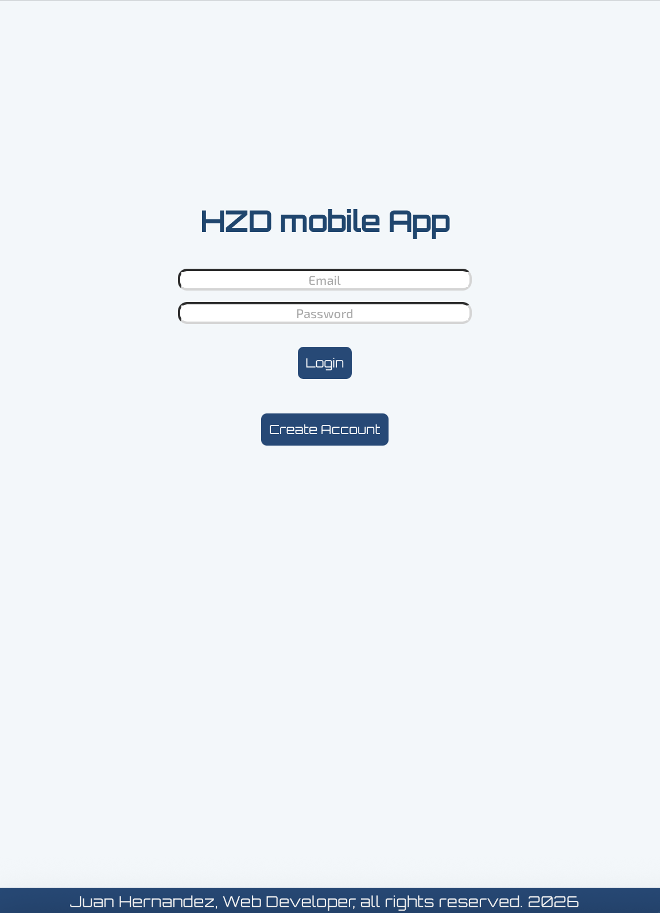
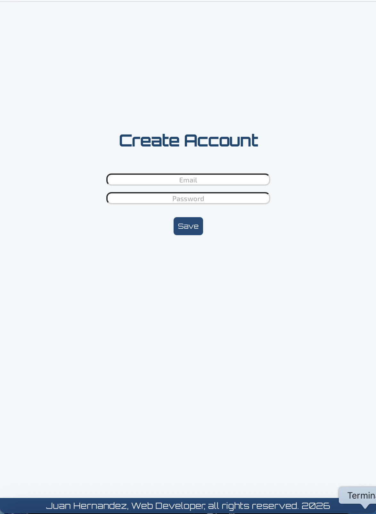
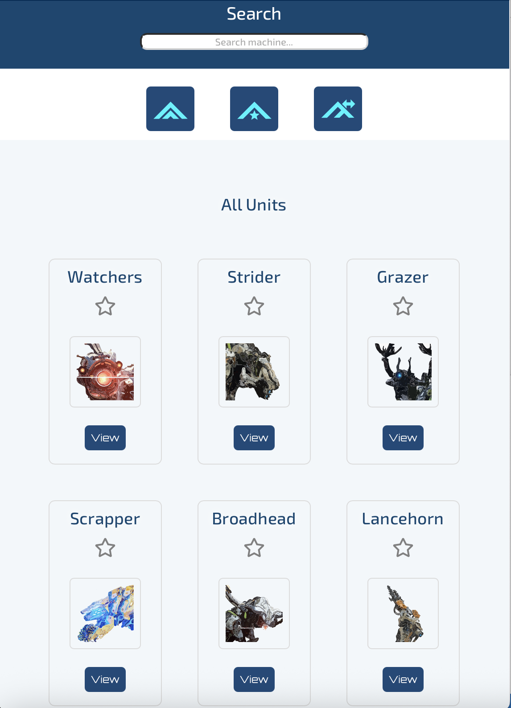
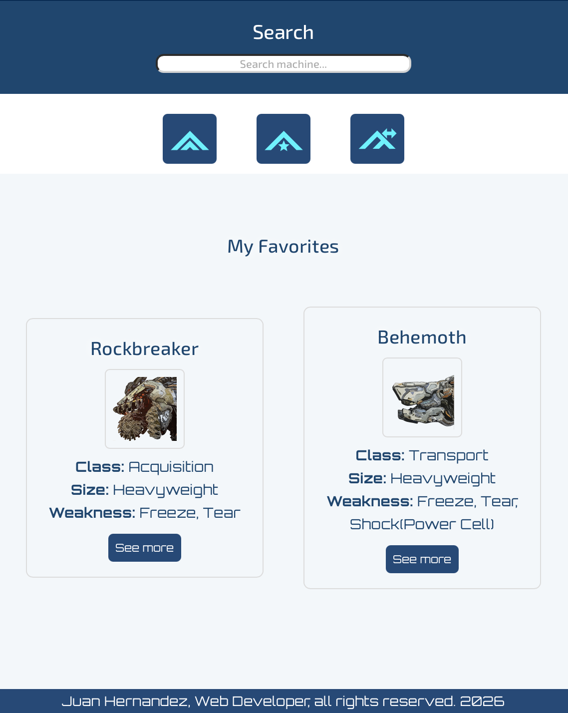
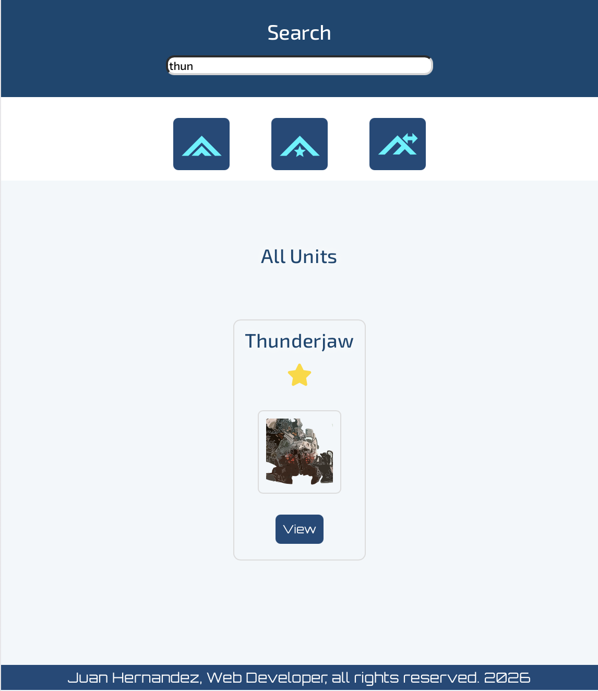
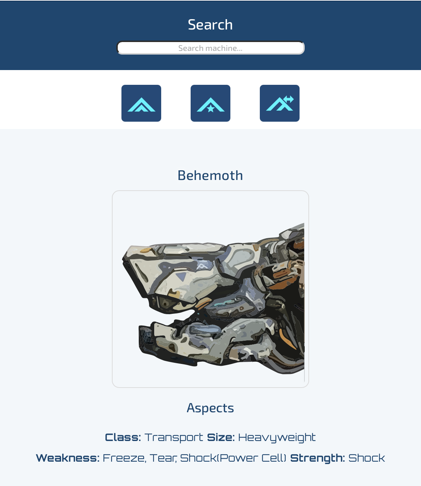
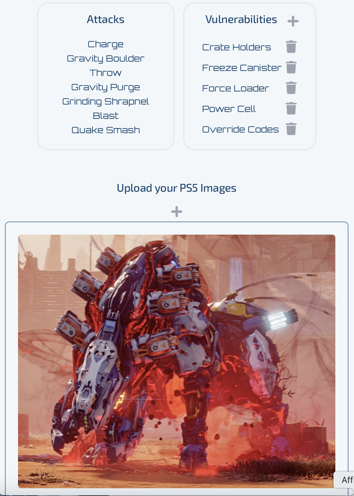
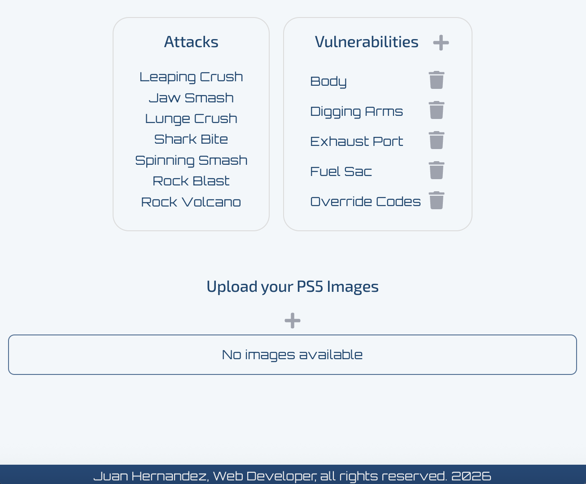

# React + Node.js - Express

A mobile application built with React, Node.js, and Express designed to support Horizon Zero Dawn players in analyzing machine weaknesses and improving combat strategies.

The platform allows gamers to upload screenshots directly from their console gameplay and inspect machine vulnerabilities, elemental weaknesses, and attack patterns. Players can organize and edit tactical information to develop more effective strategies against different machine types.

## Features
- Secure account creation and login with protected sessions.
- Search and filter machines quickly.
- Save favorite machines to a personal favorites list.
- Add and delete machine vulnerabilities.
- Upload and delete PNG or JPG gameplay screenshots from    PlayStation.
- Analyze machine features, weak points, and vulnerabilities.
- Mobile-friendly interface designed for fast access during  gameplay. 

## Tech Stack
React
Node.js
Express
REST API architecture
Image upload handling

## Screenshots

